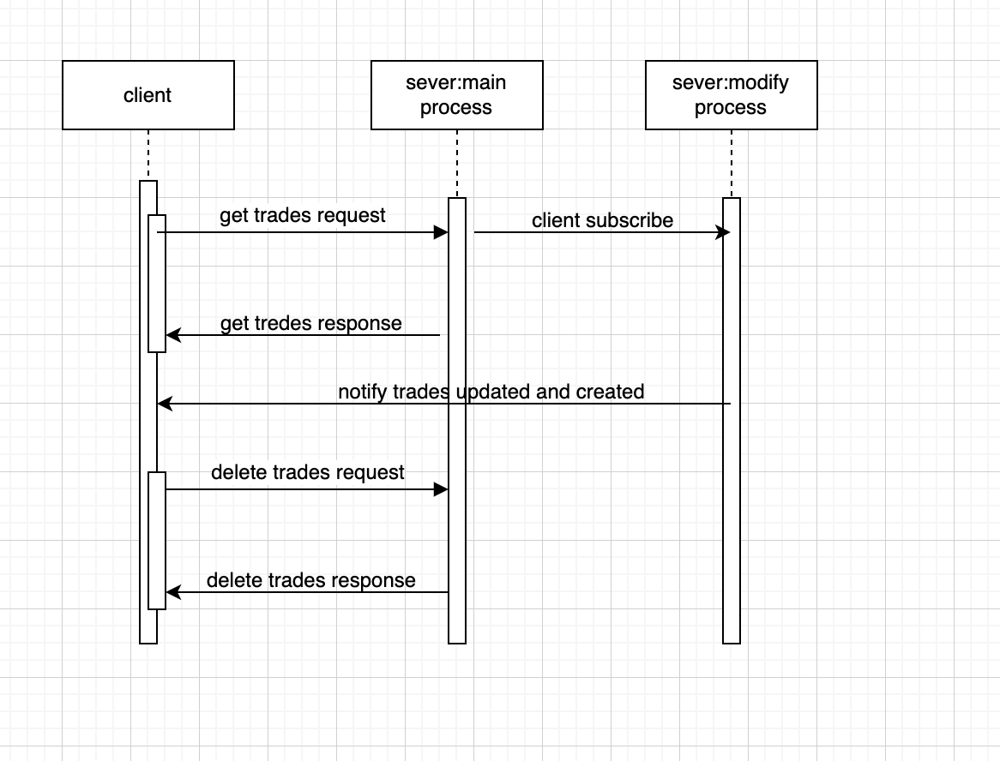

# ske-2023Q2-trade-server

This is a project which created as a sever side while I join SKE event in my company EPAM. A simple example of Trading system to practise EngX culture that's promoted by EPAM.

Similar with the front-end part, based on the principle of minimal usage of framework, scaffold and library to complement. Perform expriment in architing MVC mode upon socket server by a functional programming way fully using `Rxjs` which integrates with `ws` libray.

Gracefully implement pub-sub design pattern upon IPC communication between two processes to subscribe update event from update process in condition of after responding the request for getting trade list in main process, same as taking benefits from `Rxjs`.

## prerequisite

Please set up running environment via installing necessary software as `MongoDB`, `Node` in your computer.

## git started

To start this project, please run commands as follow.

```sh
npm install
npm run initDB
npm start
```

Install dependencies, then initialize dataset in MongoDB by running `initDB` script, and start it.

For `npm start` commit, there is three simple env variable `MODIFY_JOB`, `NEW_TRADE`, `UPDATE_TRADE` to controll whether launching job to modify trades by setting `MODIFY_JOB` true or false, anohter both boolen variable `NEW_TRADE`, `UPDATE_TRADE` is to determine if creating new trade, and updating trades which has exsited. You can check script details in the `package.json`

> Note: `npm run start:dev` command for development env is unable to run in windows with an issue about IPC problem in window while forking a new process. Please use it in other system like linux, mac.
> Relevant issues found in internet.

- [EBADF: bad file descriptor, uv_pipe_open on windows with ipc](https://github.com/moxystudio/node-cross-spawn/issues/137)
- [Node child_process.spawn bad file descriptor on windows with ipc](https://stackoverflow.com/questions/63303200/node-child-process-spawn-bad-file-descriptor-on-windows-with-ipc)

## design diagram



As above diagram showed, While client send a request to get trades, it would get response with trades payload.In the meantime subscribe the event of trades update, so it would get notification from trades update process as long as some of trades are created newly or updated.

## Q&A

- what does the typeconfig option "lib" do?

  [What does the tsconfig option "lib" do?](https://stackoverflow.com/questions/39303385/what-does-the-tsconfig-option-lib-do)

- why we need to use typescript and babel both together

  [Why would I use TypeScript and Babel together?](https://stackoverflow.com/questions/44020689/why-would-i-use-typescript-and-babel-together)

  [Is babel still relevant for Typescript project?](https://dev.to/mbeaudru/is-babel-still-relevant-for-typescript-projects-36a7)

  key takeways as follows:

  - One important aspect of babel-preset-env I think you missed: Browser Polyfills. TypeScript can transpile syntax down for older browsers, but it won't add runtime code to support something like String.prototype.replaceAll() in IE11

  - keep tree-shaking feature working to avoid it mssing.

  [how to use ifelse in rxjs](https://pazel.dev/reduce-ifelse-using-rxjs)

## Reference

[How to use ESLint with TypeScript](https://khalilstemmler.com/blogs/typescript/eslint-for-typescript/)

[How to Setup a TypeScript + Node.js Project](https://khalilstemmler.com/blogs/typescript/node-starter-project/)

[Install MongoDB Community Edition on macOS](https://www.mongodb.com/docs/manual/tutorial/install-mongodb-on-os-x/#install-mongodb-community-edition)

[mongosh](https://www.mongodb.com/docs/mongodb-shell/reference/editor-mode/)

[what is MVC](https://en.wikipedia.org/wiki/Model%E2%80%93view%E2%80%93controller)

[ws](https://github.com/websockets/ws)

[create a process with node fork](https://nodejs.org/api/child_process.html#child_processforkmodulepath-args-options)

[How To Launch Child Processes in Node.js](https://www.digitalocean.com/community/tutorials/how-to-launch-child-processes-in-node-js)

## issue

- lint-staged ignores tsconfig.json when it called through husky hooks

  https://github.com/okonet/lint-staged/issues/825

- how to fork a process to run ts script.

  https://github.com/TypeStrong/ts-node/issues/619
